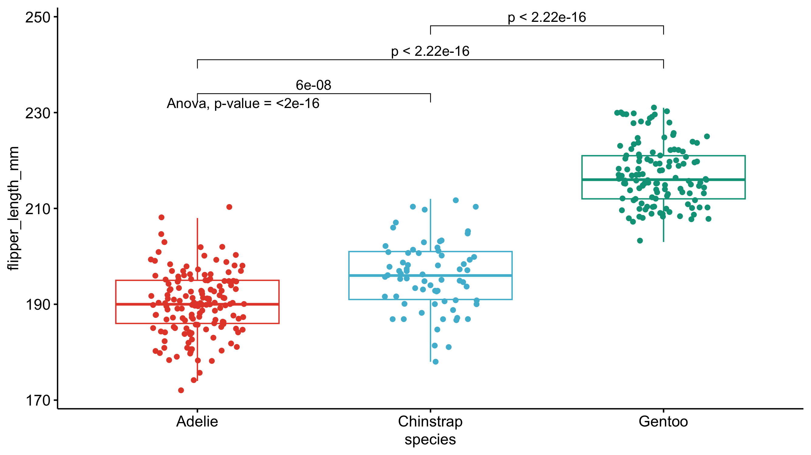

# ANOVA
The ANOVA (Analysis of Variance) separates observed variance data into different components to use for additional tests.
The ANOVA allows a comparison of more than two groups at the same time to determine whether a relationship exists between them.

The ***null hypothesis*** is that there is no difference between the tested groups.

The ***alternative hypothesis*** is that there is a difference between the tested groups.

NOTE: Using an ANOVA is just the first step of this analysis. Following a significant result from an ANOVA, a post-hoc test, like a Tukey test, should be performed.

## Values needed to conduct an ANOVA
To conduct an ANOVA using JMP, Excel, or R, you will need your data points recorded in n columns; one column for each variable.
The data for this analysis should be numeric.
If you have categorical data, make sure you transform them into numeric categories.
Then conduct the analysis by specifying which column corresponds to which group.

The data should look something like this:

| Fertilizer 1 | Fertilizer 2 | Fertilizer 3 |
| ------------ | ------------ | ------------ |
| 7            | 15           | 6            |
| 14           | 17           | 8            |
| 14           | 13           | 8            |
| 13           | 15           | 9            |
| 12           | 15           | 5            |
| 9            | 13           | 14           |
| 6            | 9            | 13           |
| 14           | 12           | 8            |
| 12           | 10           | 10           |
| 8            | 8            | 9            |

## Values returned from an ANOVA

The ANOVA will produce the following values. I have provided a brief description of how to interpret them.
- p-value: the probability that the results from your sample occurred by random chance. Important note: the p-value does not indicate that the treatment is the CAUSE. All that it states is that the two means are significantly difference from each other.
  - p-value < 0.05 indicates the means of each group are different from each other (reject the null hypothesis)
  - p-value > 0.05 indicates that you cannot conclude that means of each group are different from each other (Fail to reject the null hypothesis)
- degrees of freedom: (sample size - 1) the number of values that have the freedom to vary in the dataset.

## Post hoc test

Following the recovery of a statistically significant P-value from an ANOVA, a Tukey test should be performed to determine which of the groups are statistically different from each other.
The Tukey test does multiple pairwise comparisons between the means of each group.
This will tell you which groups within the dataset contain statistically different means.

## Visualizing the results

Just because you ran the analysis in JMP does not mean you have to use JMP to visualize your results. As long as you have a statistically significant result you can generate the plots however you would like (e.g., Excel, Google Sheets, R, Python).
All you need to do is add an annotation to the figure that specify which groups have a p-value was < 0.05.
A box-and-whisker plot would be a good way of visualizing the results of an ANOVA.
The box-and-whisker plot would present both the spread of the data while also incorporating error bars/confidence intervals.

