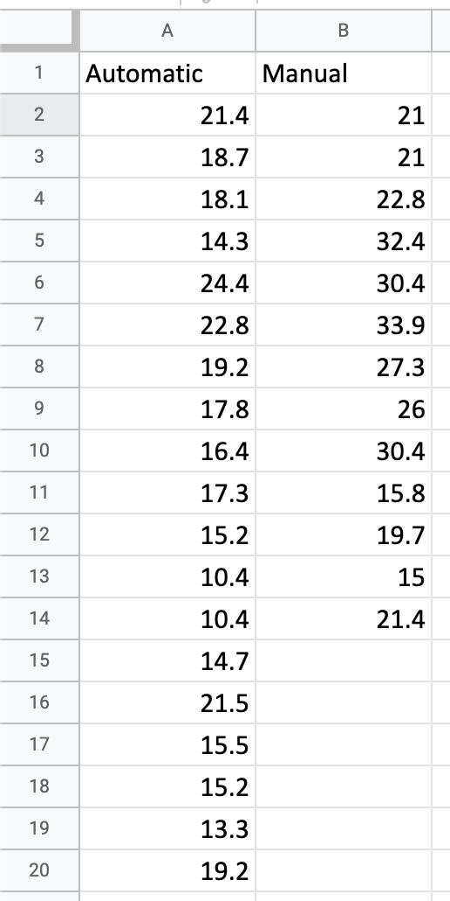
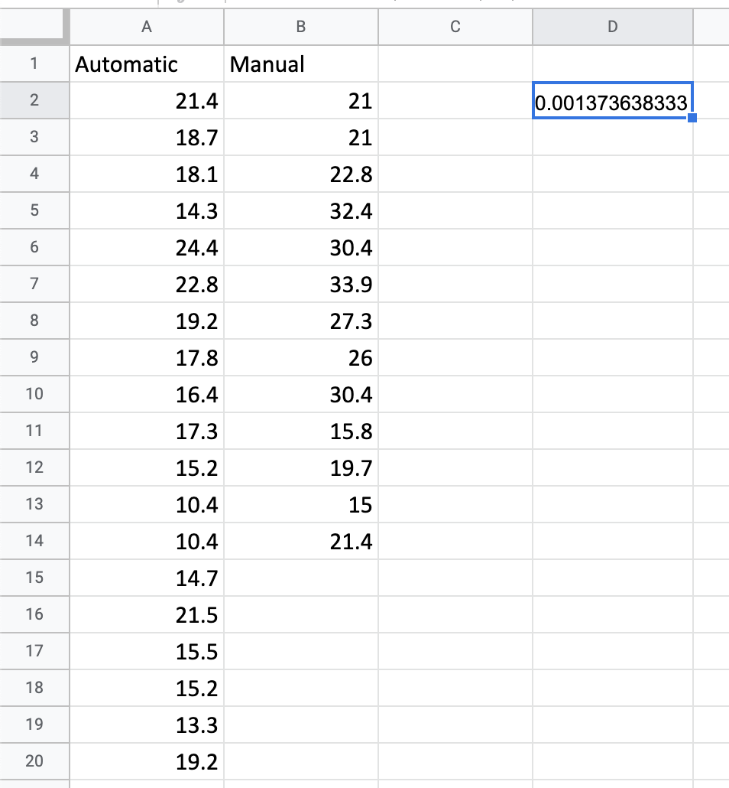

# Example workflow using this website

## Preface

In this section I will outline the thought process I would like you to follow when using this website for guidance as well as the necessary items you need to have completed before you can effectively use this site.

What you should have completed already:
- A well defined research question.
- How you have collected (or intend to collect) your data.
- Your variables.

## Example workflow

My research project is "Is there a notable difference in miles per gallon with between cars with an automatic transmission and cars with an automatic transmission?"

I have collected data that looks like this:

| Automatic | Manual |
| --------- | ------ |
| 21.4      | 21.0   |
| 18.7      | 21.0   |
| 18.1      | 22.8   |
| 14.3      | 32.4   |
| 24.4      | 30.4   |
| 22.8      | 33.9   |
| 19.2      | 27.3   |
| 17.8      | 26.0   |
| 16.4      | 30.4   |
| 17.3      | 15.8   |
| 15.2      | 19.7   |
| 10.4      | 15.0   |
| 10.4      | 21.4   |
| 14.7      | 21.0   |
| 21.5      | 21.0   |
| 15.5      | 22.8   |
| 15.2      | 32.4   |
| 13.3      | 30.4   |
| 19.2      | 33.9   |

### Identifying the broad category of the question

Out of the list of headings, my research question most closely aligns with the overarching question marked in bold:
- ***Is the research question focused on comparing the means of two or more groups?***
- Is the research question focused on comparing proportions or percentages between two or more groups?
- Is the research question focused on determining the relationship between two continuous variables?
- Is the research question focused on determining the relationship between a continuous and a categorical variable?

I know I am comparing the mean miles per gallon between 2 groups (automatic vs manual transmission).

### Deciding what statistical test to use

Now that I have identified the general comparison I would like to do, I will then look at the topic's subheadings to narrow down my assumptions about the data to determine what sort of test I should use.

Out of the list of subheadings below, bold indicates which category the data for my project is most similar to:

#### Are the groups independent or related?

***Independent groups:***
  - ***Are the data normally distributed?***
    -  ***Normally distributed:*** [t-test](../pages/ttest.md) ***or*** [ANOVA](../pages/anova.md)
    -  Not normally distributed: Mann-Whitney U test or Kruskal-Wallis test
  - Are the sample sizes equal or unequal?
    - Equal sample sizes: [t-test](../pages/ttest.md)
    - Unequal sample sizes: [Welch’s t-test](../pages/ttest.md)
Related groups:
  - Are the data normally distributed?
    - Normally distributed: [paired samples t-test](../pages/pairedttest.md) or repeated measures ANOVA
    - Not normally distributed: Wilcoxon signed-rank test or Friedman test

#### Are the groups independent or paired?

Independent groups: [chi-squared test](../pages/chisquare.md) or [Fisher's exact test](../pages/fisherstest.md)

Paired groups: McNemar’s test

### The final decision

Now that I have made the assumptions that my data contains two independent groups and the data are most likely normally distributed I have narrowed it down to two options: a T-test or an ANOVA. I then take a look at the pages for both and realize that the ANOVA would be useful for datasets containing > two categories. However, my dataset only contains two categories (automatic vs manual transmission) therefore the T-test would be a better fit.

I would then choose my analysis tool (JMP, Excel, Sheets, or R ) and run the analysis.

# Example analysis

I have included an example Excel analysis below.

1. Input all the raw data into your Excel sheet:


2. Filter any of the extra data so you are only working with the data of interest


3. Input the formula for a T-test into google sheets using the formula below. ***Make sure that the rows of column A and B are representative of the dimensions of your data.***
```
=T.TEST(A2:A20, B2:B14, 2, 3)
```

The generic format for this formula is:
```
=T.TEST(Range1, Range2, tails, type) 
```
Where
- Range1 is the rows of your first set of observations
- Range2 is the rows of your second set of observations
- Tails is either one-tailed or two-tailed (1, 2)
- Type is either paired test, two-sample equal variance or two-sample unequal variance (1, 2, 3)

4. Once you have input the formula into the cell, the number in the cell will be the p-value of the T-test.

