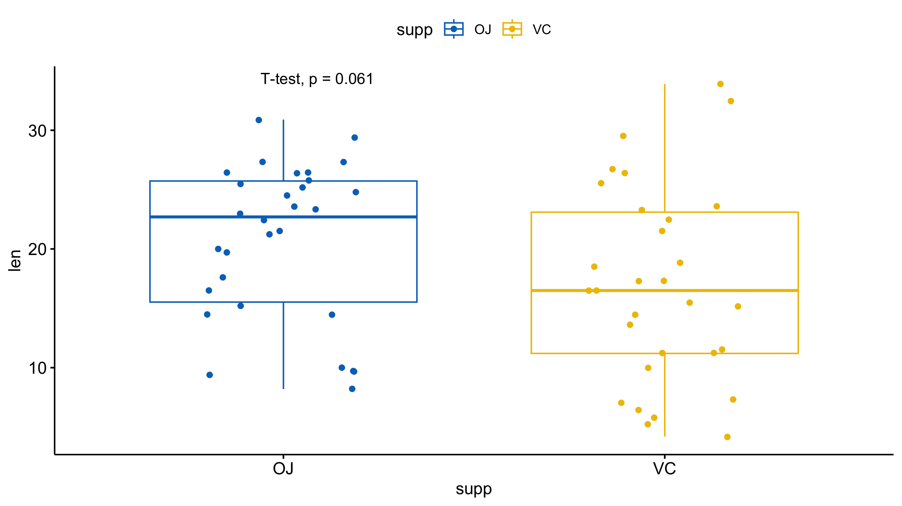

# T-test

A statistical test used to determine if there is a significant difference between the means of two groups.
Typically, the data in question follows a normal distribution with an unknown variance.
Commonly, a T-test is used to determine if a particular treatment has an impact on a population of interest.

The ***null hypothesis*** of a T-test is that the means between the two groups are the same.

The ***alternative hypothesis*** is that the means between two groups are different.

An important point to keep in mind is the whether you intend on using a one-tailed or two-tailed T-test.
A one-tailed T-test looks for either a directional (increase or decrease) change in the mean while a two tailed T-test just looks for a change (could be an increase OR a decrease).

Finally, the type of T-test you intend to use is extremely important and basically boils down to whether your two datasets have the same variance.

### Student's T-test

Then two groups are sampled from populations that are normally distributed and the variance between the populations are the same.
This is typically a very risky assumption to make BUT if you are sure that the variance between the populations is the same you can go ahead and use the Student's T-test.

### Welch's T-test

Then two groups are sampled from populations that are normally distributed and the variance between the populations are NOT the same.
I would assume that ~ 9/10 times you would be safer off using the Welch's T-test.

### Which T-test to use?

As a general rule of thumb, your default choice for conducting a T-test should be the Welch's T-test.
If, for some reason, you really want ignore this warning and choose to use the Student's T-test, you might as well run the Welch's T-test in parallel.
If the results between the two tests are the same, congratulations, you got lucky but if the results are different, trust the results from the Welch's T-test.

Here are some pointers when setting up a T-test using different tools.
- Excel
  - Student's T-test: "T-test: Two-Sample Assuming Equal Variances"
  - Welch's T-test: "T-test: Two-Sample Assuming Unequal Variances"
- R
  - Student's T-test: no
  - Welch's T-test: t.test()
- JMP:
  - Student's T-test: no
  - Welch's T-test: Two Sample T-test (assuming unequal population variances)

## Values needed to conduct a T-test

To conduct a T-test using JMP, Excel, or R, you will need your data points recorded in two columns; one column for each treatment.
The data for this analysis should be numeric.
Then conduct the analysis by specifying which column corresponds to which group.

Here is an example of how you data should be formatted:

| Height Group 1 (inches) | Height Group 2 (inches)  |
| ----------------------- | ------------------------ |
| 68                      | 48                       |
| 70                      | 50                       |
| 75                      | 60                       |
| 70                      | 52                       |
| 72                      | 55                       |
| 73                      | 58                       |
| 77                      | 56                       |
| 78                      | 59                       |
| 71                      | 51                       |

## Values returned from a T-test

The T-test will produce the following values. I have provided a brief description of how to interpret them.
- degrees of freedom: (sample size - 1) the number of values that have the freedom to vary in the dataset.
- T-score: the ratio between the difference between two groups and the difference within the groups. A larger T-score indicates a larger difference between the groups than within the groups. A smaller T-score indicates a larger difference within the group than between the groups.
- P-value: the probability that the results from your sample occurred by random chance. Important note: the p-value does not indicate that the treatment is the CAUSE. All that it states is that the two means are significantly different from each other.
  - P-value < 0.05 indicates the means of each group are different from each other (Reject the null hypothesis)
  - P-value > 0.05 indicates that you cannot conclude that means of each group are different from each other (Fail to reject the null hypothesis)

## Visualizing the results

Just because you ran the analysis in JMP does not mean you have to use JMP to visualize your results.
As long as you have a statistically significant result you can generate the plots however you would like (e.g., Excel, Google Sheets, R, Python).
All you need to do is add an annotation to the figure that the P-value was < 0.05.
A box-and-whisker plot would be a good way of visualizing the results of a T-test.
The box-and-whisker plot would present both the spread of the data while also incorporating error bars associated with the mean calculation.

